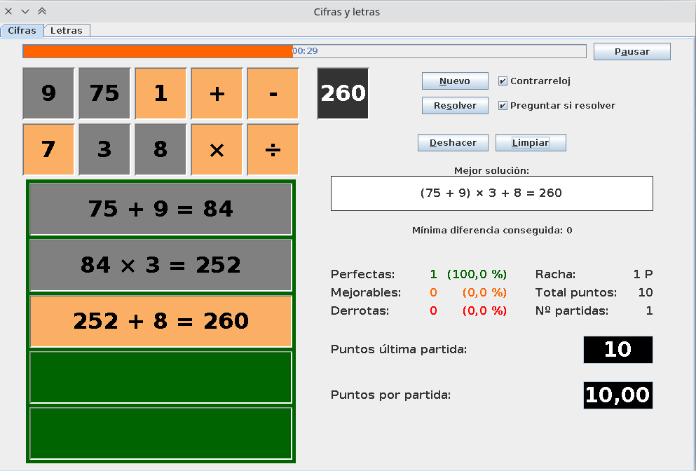
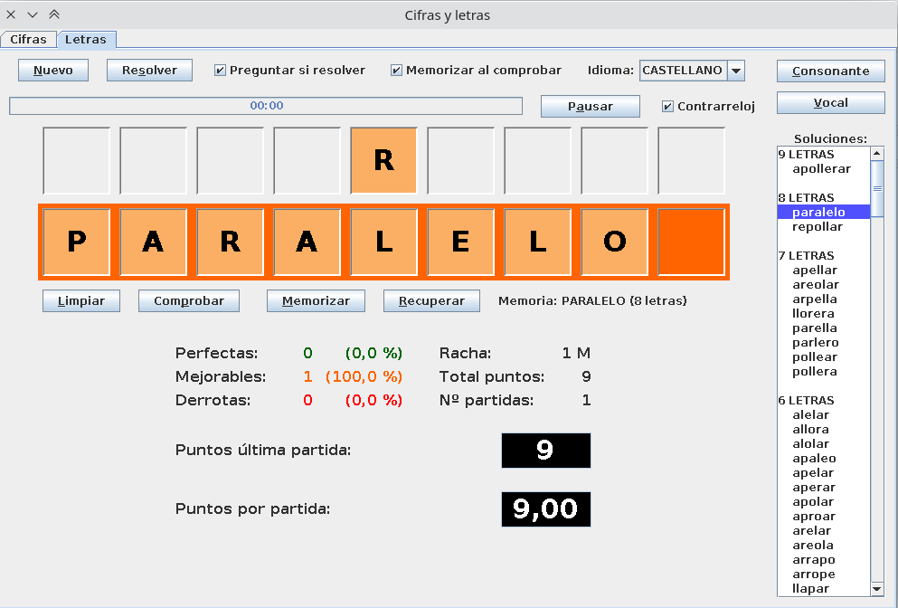

# Cifras-y-letras
Versión mejorada del juego Cifras y letras

Este programa emula el concurso de TV que emitía TVE en los años 90.

Consta de dos juegos: el de cifras y el de letras

## Cifras

A partir de seis números dados al azar (que pueden ser cualquiera del 1 al 10, 25, 50, 75 ó 100), mediante operaciones aritméticas simples (suma, resta, producto y división) se tiene que llegar a la cifra objetivo (entre 101 y 999).

Al llegar al resultado correcto (o al más próximo posible) con el menor número de cifras usadas posible, la partida termina porque se ha ganado. En caso de llegar al número objetivo con más cifras usadas de las necesarias se informa al jugador de esa situación y se le da la oportunidad de seguir intentándolo. En caso de no lograr usar el mínimo número de cifras posible se contabilizará la partida como mejorable.

Cualquiera que haya sido el resultado de la partida, al acabar se muestra una de las mejores soluciones posibles.

## Letras

El jugador saca nueve letras al azar eligiendo, en cada caso, si es consonante o vocal. Cuando se han obtenido las nueve letras se tiene que formar la palabra más larga posible.

Una vez empezado el juego el usuario puede elegir las letras disponibles simplemente tecleándolas. Al igual que en el juego de cifras una vez encontrada la palabra más larga posible se termina la partida. Si hay palabras más largas en el diccionario del juego la partida acaba como mejorable al agotarse el tiempo.

Al finalizar la partida, se muestra una lista con todas las palabras que se podían formar con las letras disponibles.

